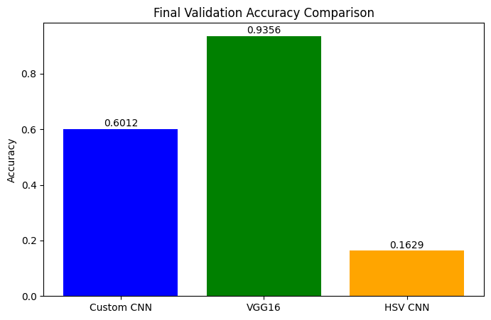
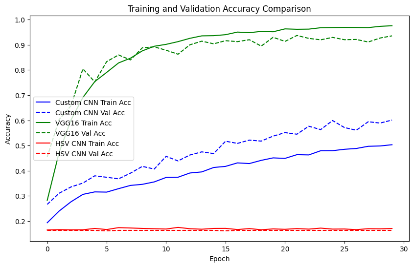
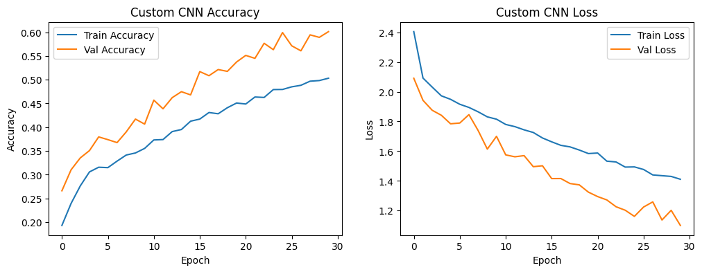
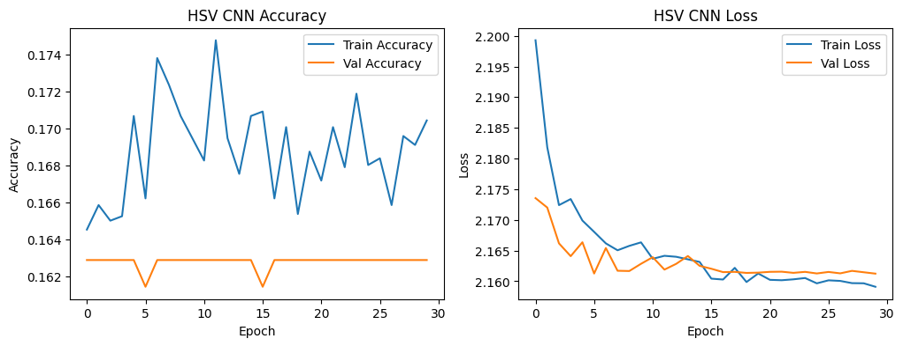
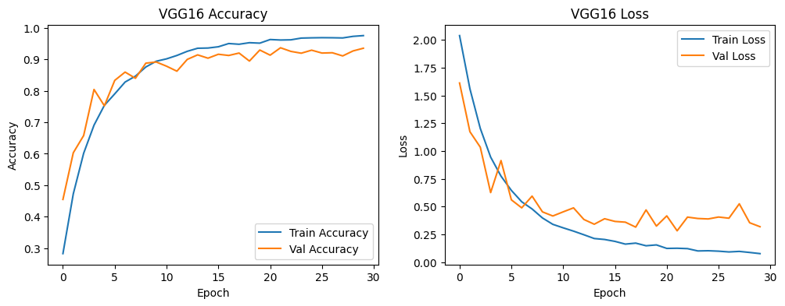
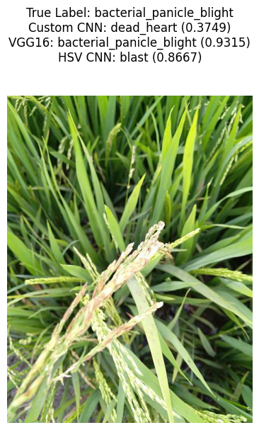

# Paddy Disease Classification

This project, developed by Ankit Singh and Bhuvan Indra G as part of the SWE2020 course, implements deep learning models for detecting and classifying diseases in paddy (rice) leaves. It uses Convolutional Neural Networks (CNNs) to classify paddy leaf images into 10 disease categories, leveraging the Kaggle "Paddy Disease Classification" dataset. The project is implemented in a Jupyter Notebook designed to run in Google Colab with GPU support.

## Project Overview

The project compares three CNN-based models:
- **Custom CNN**: A lightweight CNN built from scratch.
- **HSV CNN**: A CNN trained on images transformed to HSV color space.
- **VGG16**: A pre-trained VGG16 model fine-tuned with transfer learning.

The models are trained and evaluated on the Kaggle dataset, with preprocessing steps including image resizing, normalization, data augmentation, and HSV transformation. The VGG16 model achieves the highest validation accuracy.

## Dataset

The dataset is the "Paddy Disease Classification" dataset from Kaggle, containing 10,408 labeled RGB images across 10 classes:
- bacterial_leaf_blight
- bacterial_leaf_streak
- bacterial_panicle_blight
- blast
- brown_spot
- dead_heart
- downy_mildew
- hispa
- normal
- tungro

The dataset should be downloaded from [https://www.kaggle.com/competitions/paddy-disease-classification/data](https://www.kaggle.com/competitions/paddy-disease-classification/data).

**Download Instructions**:
1. Create a Kaggle account and verify it (requires phone verification).
2. Generate a Kaggle API key:
   - Go to Kaggle > Account > API > Create New API Token.
   - Download `kaggle.json`.
3. In Google Colab, upload `kaggle.json` when prompted by the notebook (see **Usage**).
4. The notebook automatically downloads and extracts the dataset to `/content/paddy-disease-classification`.

## Requirements

The project runs in Google Colab, which includes all necessary libraries (`tensorflow`, `numpy`, `pandas`, `opencv-python`, `matplotlib`). Additional installation of the `kaggle` package is handled in the notebook. For local execution, install dependencies from `requirements.txt`:

```bash
pip install -r requirements.txt
```

## Setup

1. **Clone the Repository**:
   ```bash
   git clone https://github.com/Bhuvan-2005/Paddy-disease-detection.git
   cd Paddy-disease-detection
   ```

2. **Open the Notebook in Colab**:
   - Upload `paddy_disease_classification.ipynb` to Google Colab or open it via the "Open in Colab" badge on GitHub.
   - Alternatively, copy the notebook content into a new Colab notebook.

3. **Configure Colab**:
   - Enable GPU: Edit > Notebook settings > Hardware accelerator > GPU.
   - Mount Google Drive in the notebook to save models.
   - Upload `kaggle.json` for dataset download.

4. **Directory Structure**:
   ```
   Paddy-disease-detection/
   ├── .gitignore
   ├── paddy_disease_classification.ipynb
   ├── README.md
   ├── LICENSE
   ├── DISCLAIMER.md
   ├── requirements.txt
   ```

## Usage

1. **Run the Notebook in Colab**:
   - Open `paddy_disease_classification.ipynb` in Google Colab.
   - Run all cells sequentially:
     - Install Kaggle API and download dataset.
     - Extract dataset to `/content/paddy-disease-classification`.
     - Mount Google Drive and set up paths.
     - Train Custom CNN, VGG16, and HSV CNN models.
     - Save models to `/content/drive/MyDrive/paddy_models/`.
     - Generate training/validation accuracy and loss plots.
     - Predict on a random image and display results.

2. **Expected Output**:
   - Models saved as `.h5` files in Google Drive.
   - Plots for accuracy/loss per model and combined comparisons.
   - Prediction results for a random image with true and predicted labels.

## Results

Based on code execution:
- **VGG16**: Highest validation accuracy (~93.56%), lowest loss (~0.3192).
- **Custom CNN**: Moderate performance (~60.12% accuracy, ~1.1006 loss).
- **HSV CNN**: Poor performance (~16.29% accuracy, ~2.1612 loss).

## Output

The following visualizations are generated during the execution of the notebook and provide insights into model performance and predictions. Ensure the images are saved in the `outputImages/` directory of the repository for proper rendering.

- **Final Validation Accuracy Comparison**: Bar chart comparing the validation accuracy of Custom CNN, VGG16, and HSV CNN models.  
  

- **Training and Validation Accuracy Comparison**: Line graph showing the training and validation accuracy of all models over epochs.  
  

- **Custom CNN Accuracy and Loss**: Line graphs displaying the training and validation accuracy and loss for the Custom CNN model over epochs.  
  

- **HSV CNN Accuracy and Loss**: Line graphs displaying the training and validation accuracy and loss for the HSV CNN model over epochs.  
  

- **VGG16 Accuracy and Loss**: Line graphs displaying the training and validation accuracy and loss for the VGG16 model over epochs.  
  

- **Sample Prediction**: Example prediction on a random image from the dataset, showing the true label and predictions from all models.  
  

## License

This project is licensed under the MIT License. See the [LICENSE](LICENSE.txt) file for details.

## Disclaimer

Please read the [DISCLAIMER](DISCLAIMER.md) for important information about the usage and limitations of this project.

## Acknowledgments

- Dataset: [Paddy Disease Classification](https://www.kaggle.com/competitions/paddy-disease-classification).
- Libraries: TensorFlow, Keras, OpenCV, Pandas, NumPy, Matplotlib.

## Contact

For issues or questions, please open an issue on GitHub or contact:
- Bhuvan Indra G
- Phone No: +91 9491149955
- [Email](mailto:gbindra21@gmail.com)
- [LinkedIn](https://www.linkedin.com/in/bhuvan-indra-995828274)
